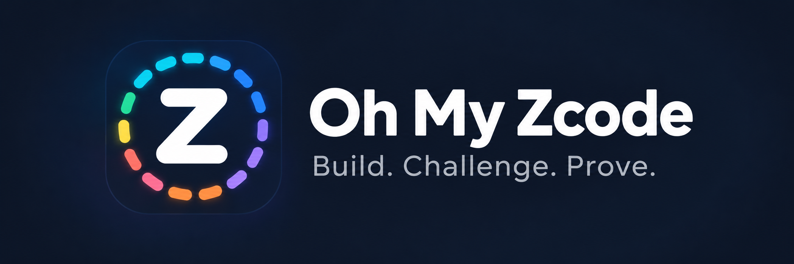

<p align="center">
  
</p>

# Oh My Zcode

> **Un agent qui écrit n'est jamais celui qui juge. Une source qu'il n'a pas ouverte n'en est pas une.**

[English](README.md) · [简体中文](README_CN.md)

[](https://github.com/UnknOownU/oh-my-zcode/blob/main/LICENSE) [](.zcode-plugin/plugin.json) [](docs/routing.md)

<details>
<summary>Sommaire</summary>

- [À propos](#à-propos)
- [Installation](#installation)
  - [Choisir une marketplace](#choisir-une-marketplace)
  - [Installer 3.0.0](#installer-300)
  - [Prompt d'installation assistée](#prompt-dinstallation-assistée)
- [Mise à jour](#mise-à-jour)
- [Utiliser Oh My Zcode](#utiliser-oh-my-zcode)
  - [Le pipeline](#le-pipeline)
  - [Les six commandes](#les-six-commandes)
    - [/ohmy-council](#ohmy-council)
    - [/ohmy-plan](#ohmy-plan)
    - [/ohmy-swarm](#ohmy-swarm)
    - [/ohmy-research](#ohmy-research)
    - [/ohmy-security](#ohmy-security)
    - [/ohmy-redteam](#ohmy-redteam)
  - [Les quatre gates](#les-quatre-gates)
- [Intégrations](#intégrations)
  - [Dépendances et réseau](#dépendances-et-réseau)
  - [Hooks](#hooks)
  - [Serveurs MCP](#serveurs-mcp)
- [Agents et modèles](#agents-et-modèles)
  - [Rôles et routage](#rôles-et-routage)
  - [Modifier le routage](#modifier-le-routage)
- [Fichiers et effets de bord](#fichiers-et-effets-de-bord)
  - [Contenu du package](#contenu-du-package)
  - [Données d'exécution](#données-dexécution)
- [Développement](#développement)
  - [Versionnage](#versionnage)
- [Désinstallation](#désinstallation)
- [Licence](#licence)

</details>

## À propos

Un agent écrit « terminé » et vous le croyez. Ce plugin lui demande de le prouver :

- **Rôles séparés** — l'agent qui écrit n'est jamais celui qui juge. Les rédacteurs produisent, les critiques jugent, les vérificateurs exécutent. Dix-sept agents, chacun avec une mission précise.
- **Gates natives** — quatre hooks Rust interceptent la session. Un `VERDICT: PASS` non prouvé, une citation d'une page jamais récupérée, une faille jamais reproduite ou une commande d'attaque hors périmètre sont **bloqués mécaniquement**. Les gates lisent ce qui s'est réellement exécuté, pas ce que l'agent affirme.
- **Tout est sur disque** — chaque exécution laisse ses preuves : plans, rapports et journaux de preuve. Chacun peut vérifier une affirmation après coup.

Le plugin couvre tout le cycle d'une tâche : évaluer une idée, la planifier, la construire, faire des recherches et tester sa sécurité — chaque étape a son pipeline et sa gate.

## Installation

### Choisir une marketplace

La version publique actuelle est la **3.0.0** : un package universel et un package natif par plateforme. Les packages natifs n'ont besoin ni de Node.js pour les hooks et le serveur scope, ni d'un compilateur. Pour installer un package natif, dans **Settings → Plugins → Create → Add marketplace**, collez l'URL JSON correspondant à la machine qui exécute ZCode — choisissez-en une seule :

```text
Windows x64          https://unknoownu.github.io/oh-my-zcode/3.0.0/x86_64-pc-windows-msvc/marketplace.json
macOS Apple Silicon  https://unknoownu.github.io/oh-my-zcode/3.0.0/aarch64-apple-darwin/marketplace.json
macOS Intel          https://unknoownu.github.io/oh-my-zcode/3.0.0/x86_64-apple-darwin/marketplace.json
Linux x64            https://unknoownu.github.io/oh-my-zcode/3.0.0/x86_64-unknown-linux-musl/marketplace.json
Linux ARM64          https://unknoownu.github.io/oh-my-zcode/3.0.0/aarch64-unknown-linux-musl/marketplace.json
```

Sur Mac, **menu Apple → À propos de ce Mac** indique la puce : Apple M1–M4 signifie Apple Silicon ; la mention d'un processeur Intel correspond à la troisième ligne du tableau. Le package universel recommandé — un petit lanceur Node autour de cinq binaires natifs — est disponible à `https://unknoownu.github.io/oh-my-zcode/marketplace.json` et nécessite **Node.js 22+**. Les alias natifs stables `https://unknoownu.github.io/oh-my-zcode/latest/<target>/marketplace.json` sont également disponibles ; les URL versionnées ci-dessus restent valides. Consultez le [guide de distribution et d'installation](docs/distribution.md).

Toutes les marketplaces natives et universelles **3.0.0** actuellement publiées utilisent **`unknoownu`**, ce qui conserve l'identité du plugin `oh-my-zcode@unknoownu`. Les anciennes distributions natives utilisaient `oh-my-zcode-<target>` ; les installations existantes provenant de ces sources gardent leur ancienne identité. Ajouter une autre URL `unknoownu` remplace la source enregistrée, pas les fichiers installés. Gardez une seule source adaptée à votre machine. Désinstallez une ancienne installation nommée selon sa cible ou installée depuis un dossier local avant de supprimer sa marketplace et d'installer depuis `unknoownu`.

### Installer 3.0.0

1. Si BetterZcode ou une autre copie de `oh-my-zcode` provient d'une ancienne marketplace ou d'un dossier local, désinstallez-la d'abord. Des identités de plugin en double peuvent bloquer l'installation.
2. Ouvrez **Settings → Plugins → Create → Add marketplace** et collez l'URL JSON universelle (Node.js 22+), ou l'URL JSON native de votre machine dans le tableau ci-dessus.
3. Ouvrez la marketplace ajoutée et installez `oh-my-zcode` une seule fois.
4. Quittez complètement ZCode, relancez-le, puis démarrez une **nouvelle session**. Sous Windows, quittez aussi depuis la zone de notification si l'application y reste active ; sur macOS, utilisez **ZCode → Quit ZCode** ou **⌘Q**.

Pour une marketplace locale manuelle, **Add marketplace** attend un dossier contenant `marketplace.json`, pas la racine du plugin extraite. Une URL de téléchargement ZIP ou une page HTML ne constitue pas une source de marketplace. Le [guide de distribution](docs/distribution.md) décrit les URL, l'installation manuelle par ZIP et les mises à jour. Ne gardez qu'une seule copie installée.

### Prompt d'installation assistée

Collez ce prompt dans une nouvelle conversation ZCode si vous souhaitez que l'agent vous guide pendant l'installation :

```text
Guide-moi de bout en bout pour installer le plugin oh-my-zcode.
1. Demande-moi sur quelle machine ZCode s'exécute, puis ouvre Settings → Plugins → Create → Add marketplace et ajoute l'URL JSON exacte correspondant à cette machine — Windows x64 : https://unknoownu.github.io/oh-my-zcode/3.0.0/x86_64-pc-windows-msvc/marketplace.json · macOS Apple Silicon : https://unknoownu.github.io/oh-my-zcode/3.0.0/aarch64-apple-darwin/marketplace.json · macOS Intel : https://unknoownu.github.io/oh-my-zcode/3.0.0/x86_64-apple-darwin/marketplace.json · Linux x64 : https://unknoownu.github.io/oh-my-zcode/3.0.0/x86_64-unknown-linux-musl/marketplace.json · Linux ARM64 : https://unknoownu.github.io/oh-my-zcode/3.0.0/aarch64-unknown-linux-musl/marketplace.json — arrête-toi et attends ma confirmation avant l'étape suivante.
2. Si BetterZcode ou une autre installation de oh-my-zcode provenant d'une ancienne marketplace ou d'un dossier local existe, fais-moi d'abord désinstaller cette copie : les identités en double peuvent bloquer l'installation. Installe ensuite oh-my-zcode une seule fois depuis la marketplace ajoutée.
3. Vérifie l'installation en trouvant le véritable installed_plugins.json de l'hôte, en lisant le installPath de l'entrée oh-my-zcode et en vérifiant que ce chemin contient .zcode-plugin/plugin.json, agents/, commands/ et skills/. Ne présume ni le système d'exploitation, ni le propriétaire, ni le chemin du cache.
4. Demande-moi de quitter complètement ZCode avec l'action de fermeture complète du système d'exploitation, de le relancer, puis de démarrer une nouvelle session.
5. Dans cette nouvelle session, confirme que /ohmy-plan, /ohmy-swarm et /ohmy-research sont disponibles et que la session a reçu la doctrine du pipeline. Signale tout élément manquant.
```

> [!NOTE]
> Redémarrez ZCode après l'installation pour recharger les déclarations MCP, puis démarrez une **nouvelle session** pour recharger les hooks.

## Mise à jour

Pour passer d'une ancienne marketplace nommée par cible ou d'une source locale à la marketplace `unknoownu` publiée, désinstallez l'ancien plugin avant de supprimer son entrée, puis ajoutez la nouvelle source et réinstallez le plugin. Ensuite, actualisez `unknoownu` dans les paramètres Plugins de ZCode et installez la mise à jour proposée. Quittez complètement ZCode, relancez-le, puis démarrez une nouvelle session. La notification de début de session **annonce uniquement** les mises à jour ; elle ne les installe pas. Cette correction reste en **3.0.0** : une correction de même version, y compris le passage entre le package universel et un package natif, exige une désinstallation puis une installation propre. Voir [mises à jour et réinstallation](docs/distribution.md#updates-and-reinstalling).

## Utiliser Oh My Zcode

### Le pipeline

```
 une idée
    │
    ▼
 /ohmy-council       cinq agents aveugles l'évaluent : poursuivre, reformuler ou abandonner
    │
    ▼
 /ohmy-plan          lire le vrai code → scaffold → plan vérifié par rapport au dépôt
    │
    ▼
 /ohmy-swarm         construire → réviser → vérifier, jusqu'aux deux signatures
    │
    ▼
 terminé — code livré, PASS signé sur des preuves d'exécution
```

Trois parcours indépendants sont aussi disponibles :

- `/ohmy-research` — une réponse sourcée, chaque source réellement ouverte
- `/ohmy-security` — un audit cadré d'une application qui vous appartient
- `/ohmy-redteam` — une chaîne d'attaque complète sur une application qui vous appartient

Chaque commande fonctionne seule ; le parcours ci-dessus est le flux naturel. Le hook `SessionStart` injecte la doctrine dans chaque session : les règles s'appliquent même sans commande.

### Les six commandes

#### /ohmy-council

**Fonctionnement :** soumet une idée à cinq agents aveugles en parallèle. Trois juges — faisabilité, risques et valeur — énoncent leurs critères AVANT de lire le briefing ; deux créatifs — angles nouveaux et territoires inexplorés — prolongent l'idée (l'explorer imagine d'abord à partir de principes fondamentaux, avant toute lecture). Aucun membre ne connaît l'existence des autres et il n'y a pas de débat ; l'agrégation suit une majorité mécanique (au moins 2 des 3 juges), tandis que les avis minoritaires restent verbatim.

**Quand l'utiliser :** avant toute construction, qu'il s'agisse d'une idée en une ligne ou d'un brainstorming complet.

**Résultat :** trois verdicts (`ENDORSE / RESERVE / REJECT`), les points de convergence, les avis minoritaires et les propositions des deux créatifs dans `.oh-my-zcode/council/<run>/`. Le rapport ne recommande rien : le conseil informe, vous décidez.

```
/ohmy-council  permettre aux joueurs d'exporter le montage de leurs meilleures parties
```

La justification de chaque mécanisme se trouve dans [docs/council.md](docs/council.md).

#### /ohmy-plan

**Fonctionnement :** reconnaissance en lecture seule du vrai code par l'explorer → `scaffold.md` (scaffold-writer) → vérification du scaffold par rapport au dépôt (scaffold-critic) → rédaction de `plan.md` (plan-writer, enregistré avant la critique) → vérification du plan par rapport à la doctrine et au code (plan-critic), avec les constats renvoyés au rédacteur. L'orchestrateur n'écrit jamais le plan.

**Quand l'utiliser :** avant d'écrire du code.

**Résultat :** un plan validé marqué **PLAN READY** dans `.oh-my-zcode/plans/<run>/`, ou bloqué avec des constats précis. Aucun code n'est écrit.

```
/ohmy-plan  ajouter une page de connexion avec des sessions qui survivent à un rechargement
```

#### /ohmy-swarm

**Fonctionnement :** la boucle de construction. Le builder implémente, le reviewer juge dans un contexte neuf (critères d'abord, verdict après le commit), puis le verifier exécute la commande décisive. La boucle continue jusqu'à obtenir les deux signatures. L'orchestrateur exécute lui-même la commande décisive : il délègue le travail, mais assume le verdict.

**Quand l'utiliser :** pour implémenter une tâche. Si `/ohmy-plan` a déjà été exécuté, la vérification du plan est sautée.

**Résultat :** du code livré et un `VERDICT: PASS` signé sur des preuves exécutées.

```
/ohmy-swarm corriger la pagination de l'API des commandes, qui ignore la dernière page
```

#### /ohmy-research

**Fonctionnement :** cadre la question, la répartit en trois axes maximum et demande aux chercheurs de récupérer les pages — un extrait de recherche n'est jamais une source. Le draft-writer transforme les notes en `report.md` ; le source-verifier confronte chaque affirmation à la source qu'elle cite, sans connaître la conclusion du chercheur.

**Quand l'utiliser :** pour toute question dont la réponse cite des sources externes.

**Résultat :** `report.md` et `SOURCES: VERIFIED` dans `.oh-my-zcode/research/<run>/` — signature ajoutée après que l'orchestrateur a ouvert lui-même les sources ; la gate des citations vérifie cette signature par rapport aux pages réellement récupérées pendant la session.

```
/ohmy-research GLM-5.3 bénéficie-t-il vraiment du chain-of-thought pour les tâches de code ?
```

#### /ohmy-security

**Fonctionnement :** consigne d'abord le périmètre dans `scope.json`, énumère la surface d'attaque dans `surface.md`, puis répartit les tests par famille — la gate de périmètre bloque mécaniquement les commandes d'attaque tant qu'un scope de test/dev n'est pas activé. Le finding-verifier **réexécute** chaque constat candidat à l'aveugle ; toute preuve incapable de déterminer le type de son affirmation (comportement ou source) est rejetée.

**Quand l'utiliser :** pour un audit de sécurité structuré d'une application qui vous appartient.

**Résultat :** un rapport contenant uniquement les constats reproduits, signé `FINDINGS: VERIFIED` et vérifié par la gate.

```
/ohmy-security https://our-staging.example.com — audit complet, cette plateforme de staging nous appartient
```

#### /ohmy-redteam

**Fonctionnement :** active le scope à partir de l'invocation : les cibles et l'environnement sont dérivés de l'argument et consignés dans `active_scope.json` pour 60 minutes ; `prod` est refusé. Le parcours cherche des **prizes** (accès à toutes les données utilisateur, droits administrateur, exécution de code) plutôt que de suivre des listes de contrôle : une `source-map.md` en boîte blanche est créée depuis le dépôt de la cible si disponible ; les attaquants reçoivent uniquement la cible et l'objectif ; les vagues se poursuivent à partir du butin de la vague précédente jusqu'à la preuve d'un prize ou jusqu'à deux vagues consécutives sans nouvelle capacité.

**Quand l'utiliser :** pour une chaîne d'attaque complète sur une application qui vous appartient.

**Résultat :** des prizes prouvés — impact démontré par un échantillon ou un callback contrôlé, revérifié à l'aveugle par le finding-verifier, nettoyage revérifié — ainsi qu'un rapport de détection par prize. Chaque entrée indique le type `behavior` ou `source` et contient un bloc `PROVENANCE` décrivant ce qui a réellement été testé.

```
/ohmy-redteam https://staging.ourapp.io — chaîne complète, nous possédons le staging
```

Le cadre est un garde-fou, pas un oracle d'autorisation : les hooks voient les commandes et dispatches de la session principale, pas l'intérieur des sous-agents. Il élève mécaniquement le niveau d'exigence, sans remplacer le jugement de l'opérateur.

### Les quatre gates

| Gate | Événement | Refuse |
|---|---|---|
| **Evidence** | `Stop` | `VERDICT: PASS` sans vérification réussie correspondante et fingerprint d'artefact récent pendant ce tour |
| **Citation** | `Stop` | `SOURCES: VERIFIED` citant une URL jamais récupérée pendant cette session (un échec de récupération ne compte jamais) |
| **Findings** | `Stop` | `FINDINGS: VERIFIED` sans résultat attendu correspondant et fingerprint d'artefact récent pendant ce tour |
| **Scope** | `PreToolUse` | les invocations d'attaque reconnues sans scope valide ; les formes d'exécution ou cibles non prises en charge ; les cibles déclarées hors périmètre ; les dispatches balisés sans URL explicitement autorisées |

Détails des preuves, assertions sur les sorties attendues, artefacts construits et limites de l'hôte : [contrat de preuve](docs/proof.md). Formes de commandes prises en charge et identité des ressources citées : [exécution avec périmètre](docs/scoped-execution.md).

## Intégrations

### Dépendances et réseau

L'environnement requis est un hôte ZCode et **Node.js 22+ dans `PATH`**. Le frontmatter des agents route les rôles intégrés vers les modèles ZAI Coding Plan `account:zai-individual-coding-plan/GLM-5.3` et `account:zai-individual-coding-plan/GLM-5.3-Flash`, au niveau d'effort déclaré. La disponibilité des modèles, les limites du compte et le trafic fournisseur dépendent du ZAI Coding Plan et de l'hôte ZCode. Rust, Cargo et un compilateur ne sont requis que pour le développement ; l'archive universelle n'en a pas besoin.

Les intégrations suivantes sont facultatives et ne s'exécutent que si leur serveur MCP ou leur commande est utilisé :

- `grep` se connecte à `https://mcp.grep.app` pour rechercher du code public.
- `semgrep` nécessite l'exécutable `semgrep` dans `PATH` et lance `semgrep mcp`.
- `osv-scanner` nécessite l'exécutable `osv-scanner` dans `PATH` et lance `osv-scanner experimental-mcp`.
- `codegraph` nécessite Node et npm. Depuis le dossier du plugin installé, activez-le avec `npm --prefix vendor/codegraph ci --omit=dev --no-audit --no-fund` ; npm peut alors télécharger le package verrouillé et sa dépendance de plateforme. Le lockfile indique que `@colbymchenry/codegraph` 1.5.0 est sous licence MIT. Son dépôt source n'est pas attesté dans ce checkout ; consultez la [fiche du registre npm](https://registry.npmjs.org/@colbymchenry%2Fcodegraph) plutôt que de supposer une URL de dépôt.

La notification de mise à jour effectue au maximum une requête `curl` anonyme par période de 24 heures, avec une limite de 2 secondes, vers l'endpoint marketplace publié (`https://unknoownu.github.io/oh-my-zcode/marketplace.json`). Aucun payload ni identifiant n'est envoyé. Un échec réseau ou de lecture du manifeste n'empêche pas la session de démarrer. La vérification signale seulement une version plus récente : elle ne télécharge ni n'installe rien. Son état utilisateur est enregistré dans `~/.zcode/cli/plugins/data/oh-my-zcode@unknoownu/update-check.json` ; ajoutez `"disabled": true` pour désactiver la vérification. `OH_MY_ZCODE_UPDATE_URL` et `OH_MY_ZCODE_UPDATE_STATE` sont des options de configuration et de test. Le comportement de référence est décrit dans le [guide de distribution et d'installation](docs/distribution.md).

Pour les commandes de recherche, les agents peuvent également utiliser les outils WebFetch/WebSearch fournis par ZCode. Ces requêtes, les appels aux modèles ZAI, le trafic facultatif vers grep.app, l'installation npm facultative et le trafic Semgrep/OSV configuré utilisent le réseau externe. Le lanceur universel ne télécharge jamais de binaire à l'exécution.

### Hooks

ZCode lit les déclarations des hooks au démarrage. Après installation ou mise à jour, quittez complètement l'application, relancez-la et démarrez une nouvelle session pour recharger les déclarations MCP et les hooks.

| Événement et matcher | Effet |
|---|---|
| `SessionStart` (`startup`, `clear`, `compact`) | injecte la doctrine du pipeline |
| `PostToolUse` (`Bash`) | enregistre les preuves d'exécution |
| `PostToolUse` (matchers de récupération/recherche Web) | enregistre les sources récupérées |
| `PreToolUse` (`Bash`) | vérifie le scope et démarre la capture de preuve |
| `PreToolUse` (`Agent`, `Task`) | enregistre les dispatches délégués |
| `Stop` | applique les gates de preuve, de citation et de constat avant toute conclusion |
| `PostToolUseFailure` (`Bash`) | enregistre les commandes échouées |

Si un empaqueteur officiel a supprimé le bit exécutable, le lanceur restaure `chmod +x` sur le binaire POSIX sélectionné. Il ne modifie que les permissions locales et ne télécharge aucun remplacement.

### Serveurs MCP

Le plugin déclare **cinq** serveurs MCP dans [`.zcode-plugin/plugin.json`](.zcode-plugin/plugin.json) — nomenclature officielle de ZCode, observée lors de l'enregistrement au démarrage à froid (2026-08-21). Fait mesuré : l'hôte ne lit les déclarations MCP du plugin qu'au démarrage de l'application. Après une installation ou une mise à jour, redémarrez ZCode ; sinon les serveurs n'apparaîtront pas dans la session.

| Serveur | Transport | Rôle |
|---|---|---|
| `scope` | stdio (`node ${ZCODE_PLUGIN_ROOT}/bin/launch.mjs scope-mcp`) | périmètre d'autorisation : `get_scope` (lecture seule, indique si le scope est armé/expiré avec une indication de réarmement) et `revoke` (désarme immédiatement) |
| `semgrep` | stdio (`semgrep mcp`) | analyse statique — nécessite le binaire `semgrep` : `pip install semgrep` |
| `osv-scanner` | stdio (`osv-scanner experimental-mcp`) | analyse des CVE de dépendances — nécessite le binaire `osv-scanner` : `scoop install osv-scanner` |
| `grep` | http (`https://mcp.grep.app`) | recherche de code dans les dépôts publics, sans binaire |
| `codegraph` | stdio (package Node externe) | indexation locale du code ; installez ses dépendances verrouillées comme indiqué dans le [guide de distribution](docs/distribution.md#optional-external-servers) |

L'indisponibilité d'un serveur externe est isolée : le serveur intégré `scope` et les gates restent indépendants. Codegraph nécessite Node ; le runtime de première partie n'en dépend pas.

## Agents et modèles

### Rôles et routage

La famille des rédacteurs garantit qu'aucun orchestrateur ne tient le stylo : 🔵 `explorer` lit, 🔵 les rédacteurs produisent les artefacts, 🟣 les critiques les évaluent.

| | Agent | Rôle | Modèle / effort |
|---|---|---|---|
| 🟣 | `plan-critic` | vérifie le plan avant la première ligne de code | `glm-5.3` / max |
| 🟣 | `scaffold-critic` | vérifie le scaffold de reconnaissance avant la création du plan | `glm-5.3` / max |
| 🔵 | `explorer` | reconnaissance en lecture seule avant tout scaffold | `glm-5.3-flash` / max |
| 🔵 | `scaffold-writer` | rédige `scaffold.md` à partir des constats de l'explorer — ne rend jamais de verdict | `glm-5.3` / max |
| 🔵 | `plan-writer` | rédige ou révise `plan.md` — ne rend jamais de verdict | `glm-5.3` / max |
| 🔵 | `draft-writer` | rédige le rapport de recherche `report.md` — ne signe jamais | `glm-5.3` / max |
| 🔵 | `builder` | implémente sans jamais se valider lui-même | `glm-5.3` / max |
| 🟡 | `reviewer` | lecture seule, commit d'abord, verdict verrouillé | `glm-5.3` / max |
| 🟠 | `verifier` | signe sur la base des preuves d'exécution | `glm-5.3-flash` / max |
| 🟠 | `source-verifier` | confronte chaque affirmation à sa source | `glm-5.3-flash` / max |
| 🟠 | `finding-verifier` | réexécute les constats de sécurité sans refaire le raisonnement | `glm-5.3-flash` / max |
| 🟣 | `council-analyst` | juge du conseil — angle faisabilité, critères définis à l'aveugle avant lecture | `glm-5.3` / max |
| 🟣 | `council-skeptic` | juge du conseil — angle risques, argument honnête le plus solide contre l'idée | `glm-5.3` / max |
| 🟣 | `council-strategist` | juge du conseil — angle valeur, l'idée doit-elle exister ? | `glm-5.3` / max |
| 🔵 | `council-innovator` | créatif du conseil — angles nouveaux sur l'idée | `glm-5.3-flash` / max |
| 🔵 | `council-explorer` | créatif du conseil — territoires inexplorés, idéation avant lecture | `glm-5.3-flash` / max |
| 🟢 | `vision` | les yeux de la session — description en lecture seule d'une image, jamais un verdict | `glm-5.3-flash` / max |

Routage mesuré (tous les sièges utilisent `max` selon le réglage du propriétaire depuis 3.0.0 ; les mesures ci-dessous documentent l'équipe) :

| Rôle | Modèle | Effort | Mesure |
|---|---|---|---|
| Travailleur (plan, construction) | `glm-5.3` | max | la qualité du plan est le plafond : 48,1 % → 74,4 % Pass@1, plan direct contre plan généré (arXiv 2303.06689) |
| Reviewer | `glm-5.3` | high | 6,2 % de faux rejets contre 21–26 % pour tous les autres (n=53) |
| Verifier | `glm-5.3` | high | glm-4.7 supprimé : 77,8 % de faux rejets sur de vrais patches multi-fichiers ; défaut identifié seulement 11,8 % du temps |
| Source Verifier | `glm-5.3` | high | 0 % de faux OK et 0 % de faux rejet, n=45 ; seuil de capacité 90,7 % contre 79,3 % (publié) |
| Finding Verifier | `glm-5.3` | max | la vérification contradictoire élimine 49,5 % des candidats (OpenAnt) ; le simple raisonnement à nouveau supprime 22,25 % de vrais positifs (Sifting the Noise) ; coût de max accepté : 28,67 points par revue |
| ⛔ Interdit pour juger | `glm-5-turbo` | — | 3 % de faux OK ; seul modèle à avoir approuvé du code défectueux |

Ne routez jamais un rôle vers `glm-5.2`, `glm-5.1`, `glm-5` ou `glm-4.5-air` : dans le Coding Plan, ce sont des **alias** qui répondent comme `glm-5.3` ou `glm-4.7` ; la « diversité des modèles » serait fictive.

Réglez `max_tokens` sur **131072**, le plafond documenté, et jamais en dessous. La facturation porte sur les tokens générés, pas sur la limite autorisée ; une réponse tronquée ne peut pas porter de verdict.

### Modifier le routage

Le modèle et le niveau de réflexion de chaque rôle sont déclarés au même endroit : le frontmatter de l'agent dans `agents/*.md`.

```yaml
model: account:zai-individual-coding-plan/GLM-5.3
thoughtLevel: max
```

Les preuves complètes de chaque choix de routage figurent dans [docs/routing.md](docs/routing.md). Le validateur natif confronte les déclarations de routage aux fichiers des agents.

## Fichiers et effets de bord

### Contenu du package

Le plugin installé contient les surfaces publiques suivantes :

| Chemin | Rôle |
|---|---|
| `.zcode-plugin/plugin.json` | métadonnées du plugin et déclarations MCP |
| `agents/` | 17 rôles et leur frontmatter ZAI Coding Plan |
| `commands/` | six commandes slash |
| `skills/` | six skills de pipeline et de revue |
| `hooks/hooks.json` | matchers de hooks de l'hôte et appels au lanceur |
| `bin/` | lanceur Node et cinq binaires de plateforme fournis dans l'archive 3.0.0 |
| `docs/brand/` | bannière et icône Oh My Zcode |
| `vendor/codegraph/` | manifeste et lockfile du package npm facultatif |

Les commandes et hooks écrivent leur état dans `.oh-my-zcode/` à la racine du projet. Selon la commande, cela inclut les dossiers `evidence/`, `plans/`, `research/`, `council/` et `security/` ; les commandes de sécurité peuvent également créer des fichiers de scope et de butin. La notification de mise à jour écrit son état de désactivation et de limitation dans le dossier de données du plugin ZCode de l'utilisateur décrit plus haut.

Le travail des agents peut exécuter des commandes shell via le scope délégué de ZCode. L'hôte affiche ces commandes à la session et les hooks de preuve enregistrent les résultats. `/ohmy-security` et `/ohmy-redteam` exigent un scope test/dev autorisé pour les commandes d'attaque reconnues ; la gate scope bloque les formes non prises en charge ou hors périmètre. Lisez [l'exécution avec périmètre](docs/scoped-execution.md) avant d'autoriser une cible.

### Données d'exécution

```
.oh-my-zcode/
├── evidence/<session id>.jsonl     écrit par les hooks — preuves
├── plans/<run>/                    scaffold.md, plan.md, report.md, evidence.jsonl
├── research/<run>/                 report.md, evidence.jsonl
├── council/<run>/                  briefing.md, report.md
└── security/
    ├── active_scope.json           écrit par /ohmy-redteam à l'invocation ; expire après 60 minutes
    ├── loot.md                     registre de la chaîne
    └── <run>/                      scope.json, surface.md, report.md, evidence.jsonl
```

Le journal de preuve contient `kind: "evidence"` pour une commande exécutée, `kind: "source"` pour une page récupérée et `kind: "search"` pour une requête — enregistrée, mais jamais considérée comme lue. La gate ne lit que le journal des hooks, jamais le rapport.

## Développement

```bash
cargo build --locked
cargo test --workspace --locked
cargo run --locked -- validate plugin
node test_gate.mjs
```

Exécutez ces commandes depuis la racine du dépôt. Le développement nécessite Rust ; les tests du contrat de processus nécessitent Node. Les utilisateurs finaux installent des packages précompilés. Consultez `docs/rust-development.md` à la racine du dépôt pour les contrôles qualité et le packaging.

### Versionnage

Le versionnage suit [docs/versioning.md](docs/versioning.md) — la branche 1.x est terminée et l'ère MCP 2.x a été publiée (2026-08-21). La version 3.0.0 actuelle privilégie la marketplace universelle et conserve cinq packages natifs actifs, un par plateforme, comme alternative sans Node. Une correction de même version nécessite une réinstallation propre, en ne gardant qu'une seule copie.

## Désinstallation

Dans **Settings → Plugins → oh-my-zcode → uninstall**. Les données d'exécution restent dans `.oh-my-zcode/`.

## Licence

[Licence MIT](https://github.com/UnknOownU/oh-my-zcode/blob/main/LICENSE).
